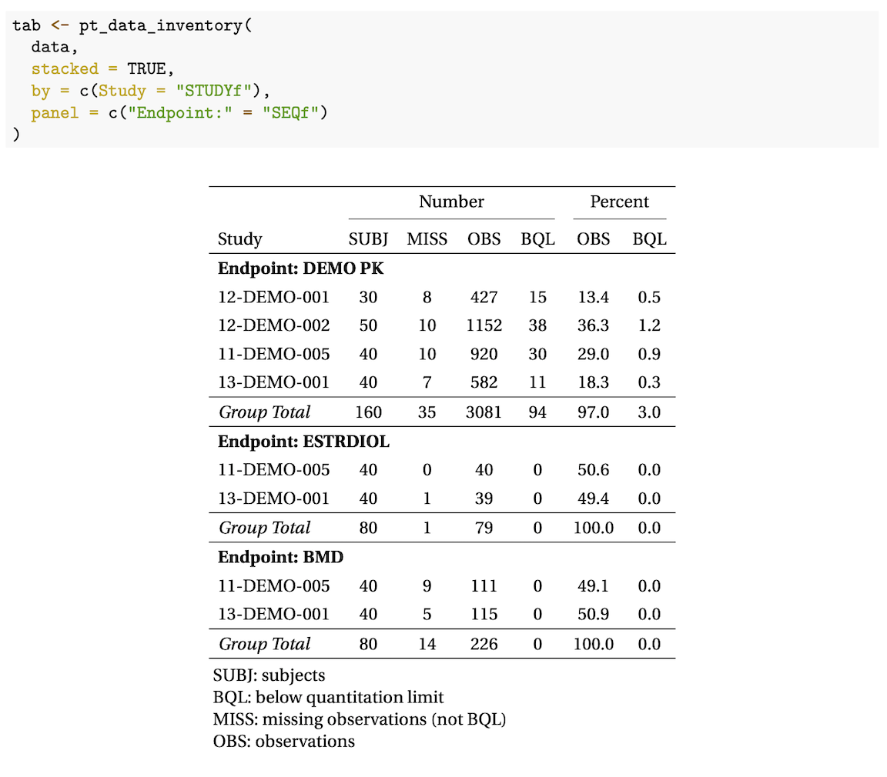

<!-- README.md is generated from README.Rmd. Please edit that file -->

```{r, include = FALSE}
set.seed(1010)
knitr::opts_chunk$set(
  collapse = TRUE,
  comment = ".",
  fig.path = "man/figures/README-",
  warning = FALSE, 
  message = FALSE,
  fig.width = 5, 
  fig.height = 4
)
```


# pmtables 

<!-- badges: start -->
<!-- badges: end -->

The goal of pmtables is to create summary tables commonly used in 
pharmacometrics.

## Installation

You can install the released version of pmtables from [MPN](https://mpn.metworx.com/docs/) with:


```r
mpn <- "https://mpn.metworx.com/snapshots/stable/2021-06-20"
install.packages("pmtables", repos = mpn)
```

This installs from a specific, dated snapshot. Please check 
https://mpn.metworx.com/docs/snapshots/ for the most recent snapshot date.

You can install the development version from [GitHub](https://github.com/) with:

``` r
# install.packages("devtools")
devtools::install_github("metrumresearchgroup/pmplots")
```

# Documentation 

We maintain a pmtables book [here](https://github.com/metrumresearchgroup/pmt-book)


## Examples

### Data Disposition
{ width=85% }

### Continuous Covariate Summary
{ width=85% }

### Discrete Covariate Summary
{ width=85% }


# Examples in working docs

- General table examples: [inst/demo-table.pdf](https://github.com/metrumresearchgroup/pmtables/blob/develop/inst/demo-table.pdf) 

- General tables - pipe interface: [inst/demo-pipe.pdf](https://github.com/metrumresearchgroup/pmtables/blob/develop/inst/demo-pipe.pdf) 
- Standard table examples: [inst/demo-pmtable.pdf](https://github.com/metrumresearchgroup/pmtables/blob/develop/inst/demo-pmtable.pdf)

- Long table examples: [inst/demo-longtable.pdf](https://github.com/metrumresearchgroup/pmtables/blob/develop/inst/demo-longtable.pdf)

- What is sanitized: [inst/demo-sanitize.pdf](https://github.com/metrumresearchgroup/pmtables/blob/develop/inst/demo-sanitize.pdf)
