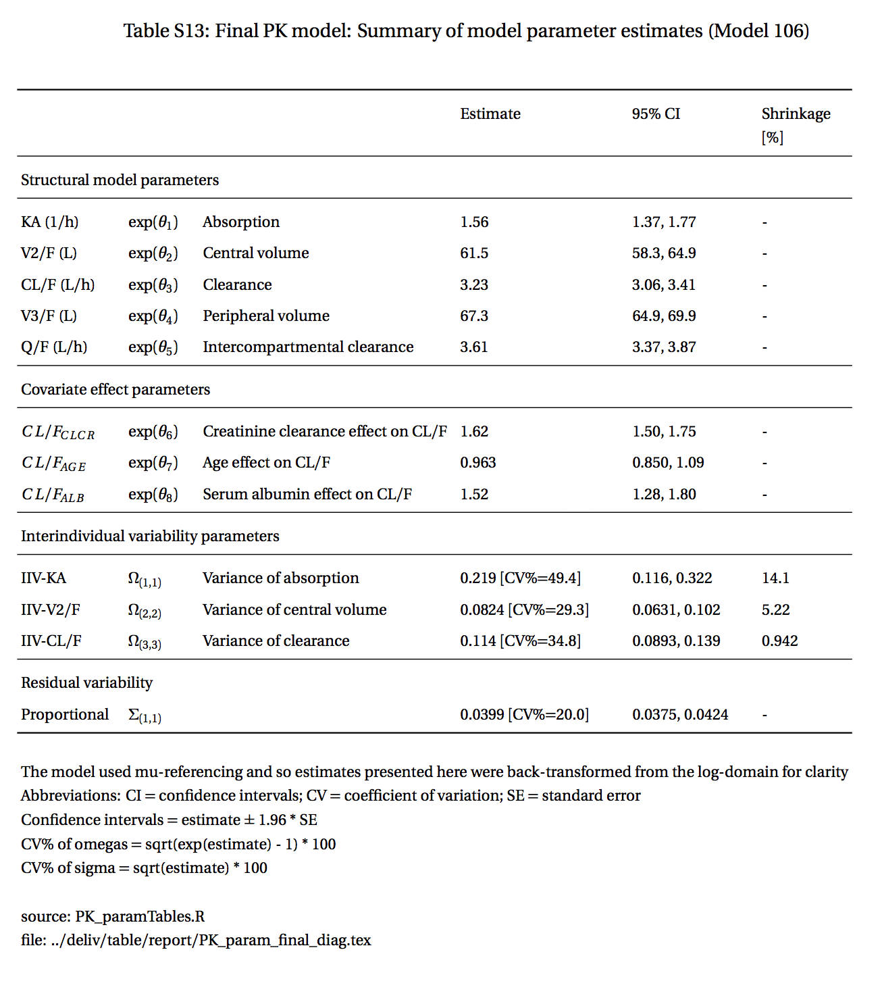

```{r setup, include=FALSE}
knitr::opts_chunk$set(echo = TRUE)
units <- list(WT = "(kg)", BMI = "(kg/m2)", CRCL = "(mL/min)")
table <- list(WT = "weight", BMI = "body mass index", 
              CRCL = "creatinine clearance")
```


```{r,message=FALSE,warning=FALSE}
library(dplyr)
library(mrggt)
library(pmtables)
```

```{r}
data <- pmtables:::data("id")
```

# Continuous covariates

## Long

```{r}
pt_cont_long(
  data, 
  cols = "WT,BMI,CRCL", 
  panel = vars(Study = STUDYf), 
  units = units, 
  table = table
)
```

## Wide

```{r}
pt_cont_wide(
  data, 
  cols = "WT,BMI,CRCL", 
  by = vars(Study = STUDYf), 
  units = units, 
  table = table
)
```


# Categorical covariates


## Long

```{r}
pt_cat_long(
  data, 
  cols = vars(Sex = SEXf, "Renal function" = RFf, Formulation = FORMf), 
  by = vars(Study = STUDYf),
  table = table
)
```

## Wide

```{r}
pt_cat_long(
  data, 
  cols = vars("Child-Pugh" = CPf, "Renal function" = RFf, Formulation = FORMf), 
  by = vars(Sex = SEXf),
  table = table
)
```


# Data inventory

```{r}
pt_data_inventory(
  data, 
  by = vars(Study = STUDYf)
)
```

```{r}
pt_data_inventory(
  data, 
  by = vars(Study = STUDYf), 
  panel = vars(Formulation = FORMf)
)
```


```{r}
obs <- pmtables:::data("obs")

pt_data_inventory(
  obs, 
  panel = vars(Endpoint = SEQf),
  by = vars(Study = STUDYf),
  stacked = TRUE
)
```


# Parameter table


{width=90%}

